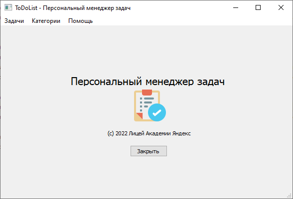
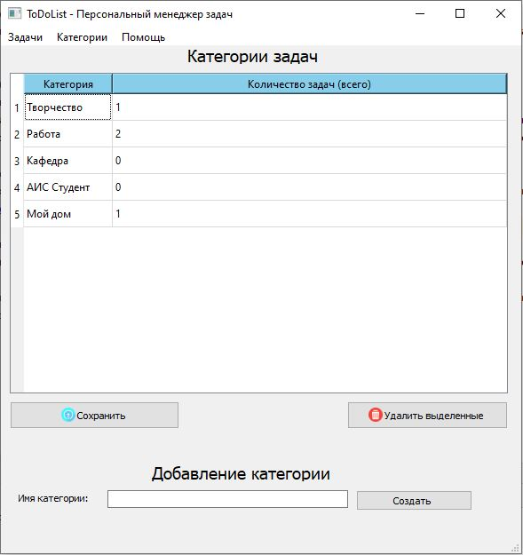
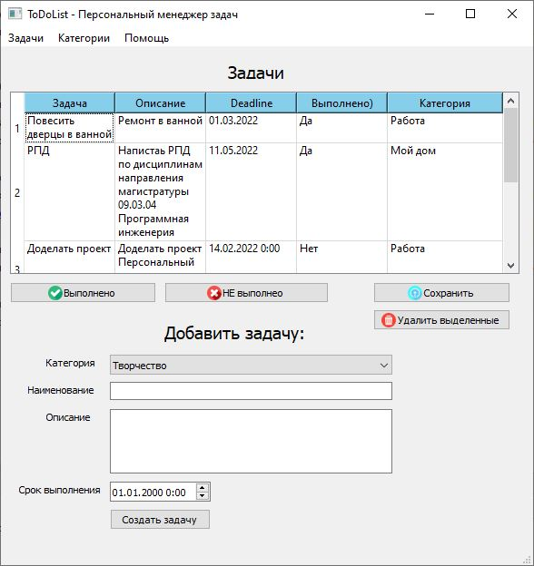
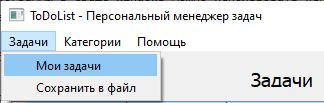

# ToDoList
## Персональный менеджер задач на PyQT и SQLite

### Назначение приложения
Программа позволяет вести на локальном компьютере список задач, разделенных по категориям с указанием статуса выполнения, даты и времени дедлайна.

### Установка и запуск
Запустить приложение с использованием интерпретатора Python можно при помощи файла **main.py** 
Для запуска программы в среде Windows можно использовать исполняемый модуль main.exe, который находится в папке dist.
База данных на SQLite размещена в файле **todolist.db** и содержит две связанные таблицы - категории и задачи. 

### Руководство пользователя

#### Главное окно и меню приложения
Окно приложения имеет меню, при помощи которого вызываются формы и выполняются основные действия:

Интерфейс приложения состоит из двух основных форм - Категории и Задачи, коорые доступны через главное меню.
Форма  позволяет создавать, просматривать, редактировать и удалять категории задач. Отображение данных производится при помощи объекта QTableWidget.

#### Работа с категориями
Окно категорий позволяет просмотреть, отдедактировать, создать или удалить категорию задач. Также доступны групповые операции над задачами - отметить как ВЫПОЛНЕННЫЕ или НЕВЫПОЛНЕННЫЕ. 

#### Работа с задачами
Окно задач позволяет просмотреть, отдедактировать, создать или удалить задачи.
При создании задачи категория выбирается из выпадающего списка, который формируется динамически на основании запроса к БД (таблица Task).

#### Экспорт списка задач в файл
При выборе пункта меню **Задачи/Сохранить в файл** все задачи из списка будут сохранены в файле **tasks.csv**
